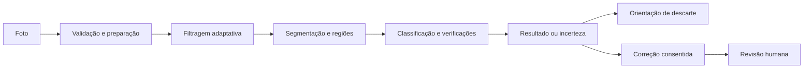

# EcoScan

**Da imagem à orientação de descarte, com educação ambiental e revisão humana.**

Aplicação web para celular e computador que combina processamento digital de imagens, classificação de resíduos e orientações de descarte. O piloto conecta participantes a uma área de gestão que simula o trabalho de uma secretaria ambiental.

[Acessar o piloto](https://ecoscan-gabrielhamad.streamlit.app/) · [Guia do grupo](docs/guia_do_grupo.md) · [Arquitetura](docs/arquitetura_atual.md) · [Como contribuir](CONTRIBUTING.md)

> **Status: piloto acadêmico em validação.** Não é um serviço oficial da Prefeitura e não substitui a orientação do operador de coleta. O reconhecimento pode errar, inclusive em objetos comuns. Não há garantia de identificar todo resíduo.

## Sumário

- [Proposta](#proposta)
- [Recursos e perfis](#recursos-e-perfis)
- [Escopo](#escopo)
- [Pipeline de análise](#pipeline-de-análise)
- [Execução local](#execução-local)
- [Banco e autenticação](#banco-e-autenticação)
- [Testes e publicação](#testes-e-publicação)
- [Aprendizado supervisionado](#aprendizado-supervisionado)
- [Estrutura](#estrutura)
- [Próximas entregas](#próximas-entregas)
- [Documentação e direitos de uso](#documentação-e-direitos-de-uso)

## Proposta

O EcoScan procura reduzir dúvidas sobre separação e destinação de resíduos do dia a dia. A experiência começa pela foto, apresenta uma hipótese de categoria e orienta o descarte; o participante pode reportar um erro para revisão da equipe. Missões e conteúdo educativo complementam o fluxo.

O projeto torna observáveis as etapas de processamento de imagem do trabalho acadêmico: métodos utilizados, comparação antes/depois, máscara e regiões encontradas. Os requisitos acadêmicos estão no [checklist da APS](docs/checklist_aps.md); a interface pública usa linguagem de produto.

## Recursos e perfis

| Perfil | Recursos | Condições |
| --- | --- | --- |
| Visitante | Analisar foto, consultar descarte, coleta e conteúdo educativo | Análise temporária; não acumula participação persistente |
| Participante | Recursos públicos, correções consentidas, protocolos e participação | Cadastro, confirmação do e-mail e login |
| Analista | Revisar correções, responder protocolos, consultar cadastros e operar ferramentas de gestão | Identidade verificada e autorização explícita |

O parâmetro de perfil na URL **não concede acesso administrativo**. O mesmo link público atende participantes e analistas; os recursos dependem da autenticação.

| Área do participante | Finalidade |
| --- | --- |
| Escanear | Tirar/enviar foto e consultar resultado com orientação |
| Mapa | Consultar coleta em São Paulo e abrir rotas externas |
| Descarte | Orientação por material, incluindo casos de confirmação manual |
| Aprender | Por que reciclar, possíveis novos produtos e fontes consultadas |
| Missões | Atividades educativas e participação vinculada ao perfil |
| Denunciar | Relatos de descarte inadequado; fluxo distinto da correção de reconhecimento |
| Perfil | Participação e protocolos vinculados à conta |

**Coleta:** a base auditada em 20/09/2026 contém seis ecopontos, não todos os pontos de São Paulo. Há acesso ao mapa municipal completo. A base não possui coordenadas verificadas para ordenar por proximidade, nem aceitação presumida de pilhas e eletrônicos. Veja a [auditoria](docs/education_and_collection_audit.md).

## Escopo

As seis categorias ativas estão em [config/settings.json](config/settings.json). Os objetos abaixo são alvos de coleta e avaliação, não uma certificação de desempenho.

| Categoria | Objetos prioritários | Variações importantes |
| --- | --- | --- |
| `plastic` | Garrafa PET, pote e frasco rígido vazio | Transparência, cor, rótulo e deformação |
| `metal` | Lata de bebida ou conserva vazia | Inteira, amassada, achatada, com/sem rótulo |
| `paper_cardboard` | Caixa, folha e jornal | Montado, dobrado, rasgado e impresso |
| `glass` | Garrafa e pote de embalagem | Cores e transparência; cacos são casos difíceis |
| `battery` | Pilhas domésticas AA/AAA | Marca, tamanho e agrupamento; outras baterias exigem revisão |
| `electronic` | Celular, mouse e carregador de celular | Frente, verso, lateral e cabos |

Óleo de cozinha e medicamentos têm **orientação assistida**, não reconhecimento automático do conteúdo. Orgânicos e alimentos estão fora do escopo. Não manipule resíduos perigosos para melhorar um teste. Veja [escopo e variações](docs/escopo_e_variacoes.md).

## Pipeline de análise



1. **Entrada:** validação do arquivo, leitura RGB, redimensionamento e diagnóstico de qualidade.
2. **Filtragem:** comparação heurística de sequências com Gaussiano, mediana, bilateral e CLAHE, incluindo a opção de não filtrar.
3. **Segmentação:** seleção entre Otsu, limiares em HSV e GrabCut; geração de máscara e análise de regiões.
4. **Reconhecimento:** classificação, verificações de material e restrição às categorias do piloto.
5. **Apresentação:** original/processamento, método escolhido, regiões e orientação quando houver resultado aceito.

O modo adaptativo usa métricas e regras: não prova que escolheu o melhor método para toda imagem. O mapa visual de regiões **não é imagem térmica nem explicação Grad-CAM**. Regiões segmentadas não equivalem a objetos semanticamente identificados.

O serviço suporta baseline, KNN visual, SVM e Keras. Sem um modelo final `.keras`, o artefato `models/vision_classifier.npz` tem prioridade quando disponível. Configurar MobileNetV2 não significa que ela já esteja treinada ou publicada. Veja o [pipeline](src/ecoscan/app/pipeline.py) e o [serviço de análise](src/ecoscan/services/analysis_service.py).

## Execução local

Pré-requisitos: Git e Python **3.11 ou superior**; **3.12** é recomendado para compatibilidade com treinamento opcional. O clone exige permissão caso o repositório esteja privado. O dataset completo não acompanha o Git.

```bash
git clone https://github.com/Gabrielhamad/ecoscan.git
cd ecoscan
python -m venv .venv
```

Ative o ambiente conforme o sistema:

```powershell
# Windows PowerShell
.\.venv\Scripts\Activate.ps1
```

```bash
# Linux/macOS
source .venv/bin/activate
```

Instale e execute a partir da raiz do repositório:

```bash
python -m pip install --upgrade pip
python -m pip install -r requirements.txt
python -m pip install --no-deps -e .
python -m streamlit run streamlit_app.py
```

Abra `http://localhost:8501`. Se a porta estiver ocupada, use `python -m streamlit run streamlit_app.py --server.port 8502`. Sem credenciais de nuvem, é possível experimentar como visitante; cadastro e persistência compartilhada exigem configuração.

**Celular:** o `localhost` do aparelho não é o computador. Para testes remotos, use a URL pública HTTPS. O seletor de câmera/galeria depende do navegador. O **EcoScan Live** é um servidor separado e não é publicado automaticamente com o Streamlit. Veja [acesso multidispositivo](docs/acesso_multidispositivo.md) e [câmera ao vivo](docs/live_camera_mobile.md).

## Banco e autenticação

O backend integra Supabase Auth, PostgreSQL e Storage privado. Preparar um ambiente novo é responsabilidade do mantenedor, não de cada colega que vai testar.

1. Aplicar, na ordem, [migration 001](migrations/001_contributions.sql) e [migration 002](migrations/002_operational_records.sql).
2. Conferir RLS e bucket privado, sem liberar acesso direto público às tabelas.
3. Configurar credenciais somente em `.streamlit/secrets.toml` local ou nos Secrets da hospedagem.
4. Configurar SMTP, URL de retorno e confirmação de e-mail; testar entrega antes de liberar cadastro.
5. Autorizar analistas explicitamente e testar isolamento entre contas.

Exemplo mínimo para **Supabase Auth**, com valores fictícios:

```toml
[persistence]
url = "https://SEU_PROJETO.supabase.co"
service_key = "CHAVE_PRIVADA_SOMENTE_NO_SERVIDOR"
operations_enabled = true

[access]
public_signup_enabled = false
supabase_admin_emails = []
```

Ative `public_signup_enabled` somente após validar SMTP e confirmação. Autorize apenas e-mails verificados. Não copie o bloco OIDC do [exemplo completo](.streamlit/secrets.example.toml) sem configurar esse provedor: OIDC é uma alternativa, não requisito do login Supabase.

| Informação | Persistência implementada |
| --- | --- |
| Identidade e confirmação de e-mail | Supabase Auth |
| Correções de reconhecimento, revisão e resposta | PostgreSQL e foto no Storage privado, quando configurados |
| Pontos e registros de testes | PostgreSQL com `operations_enabled = true` e migration 002 |
| Campanhas, denúncias cívicas e artefatos de treino | Arquivos locais; ainda não totalmente migrados |
| Histórico técnico local | Não deve ser tratado como histórico durável compartilhado |

Falha do banco configurado não deve virar gravação local silenciosa. Arquivos locais da hospedagem não garantem durabilidade. A chave privilegiada é exclusiva do servidor; a aplicação também valida identidade e acesso. Veja [banco](docs/banco_gratuito.md), [login](docs/login_piloto.md) e [aceite](docs/aceite_banco_piloto.md).

## Testes e publicação

Com o pacote instalado em modo editável:

```bash
python -m unittest discover -s tests
```

A suíte cobre processamento, serviços, autorização, persistência com simulações e partes da interface. Não comprova acurácia, entrega de e-mail, integração real da nuvem ou funcionamento em todos os celulares. O [guia do grupo](docs/guia_do_grupo.md) complementa a suíte com testes manuais.

Para publicar, envie alterações revisadas ao repositório ligado ao Streamlit e confira a implantação e os logs. Um `git push` bem-sucedido não comprova que a nova versão já está disponível. Veja [hospedagem](docs/hospedagem_gratuita.md).

## Aprendizado supervisionado

```text
Foto com erro + consentimento + categoria sugerida
    -> protocolo -> revisão do analista -> aprovação ou rejeição
    -> exportação das aprovadas -> curadoria e treino local
    -> avaliação independente -> decisão de publicação
```

**Reportar ou aprovar uma imagem não altera automaticamente o modelo ativo.** Com persistência remota, o treino de candidatos na hospedagem está bloqueado; o fluxo previsto é exportar e treinar localmente. Separe dados por objeto/cena antes de gerar variações para evitar vazamento entre treino e teste.

Avalie precisão, recall, F1, matriz de confusão, rejeição de desconhecidos e fotos reais. Para vídeo, avalie também latência e estabilidade. Não substitua o modelo com base somente no acerto das imagens usadas no treino. Veja [operação da secretaria](docs/operacao_secretaria.md) e [gestão do dataset](docs/gestao_dataset_e_classes.md).

## Estrutura

```text
streamlit_app.py          Entrada da aplicação hospedada
src/ecoscan/
  app/                   Pipeline de processamento
  image_processing/      Validação, qualidade e filtros
  segmentation/          Máscaras, seleção adaptativa e regiões
  classification/        Atributos e classificadores
  training/              Treinamento opcional por transferência
  services/              Casos de uso, identidade e persistência
  disposal/              Orientações e pontos de coleta
  live_camera/           Servidor e rastreamento experimental
  ui/                    Interface Streamlit
config/                  Classes, parâmetros, campanhas e orientações
migrations/              Esquema e proteções do banco
templates/               Modelo de e-mail de confirmação
assets/                  Recursos visuais
models/                  Artefatos de inferência selecionados
data/                    Dados locais; originais e splits fora do Git
scripts/                 Ferramentas de análise, treino e operação
tests/                   Testes automatizados
docs/                    Documentação técnica e acadêmica
reports/ e logs/          Saídas locais, em geral fora do Git
```

## Próximas entregas

- Validar ponta a ponta: cadastro, confirmação, analista, reporte e resposta entre contas reais.
- Melhorar reconhecimento com curadoria e avaliação independente por classe e estado.
- Migrar campanhas e denúncias para armazenamento compartilhado durável.
- Completar recuperação de senha e gestão de sessões; fortalecer proteção contra abuso.
- Definir retenção, exclusão, backups e procedimento de incidentes antes do uso amplo.
- Ampliar coleta com fontes auditáveis e coordenadas verificadas.
- Validar acessibilidade e dispositivos reais; medir a câmera separadamente.

Não há resultado medido de massa reciclada, emissões evitadas ou renda gerada pelo EcoScan. Fotos, pontos e missões não comprovam entrega física.

## Documentação e direitos de uso

Comece pelo [índice de documentação](docs/README.md). Documentos de fases anteriores podem conter escopos históricos; código/configuração e guias atuais orientam a operação. README revisado em **23/09/2026**, sem substituir uma verificação do serviço hospedado.

Não publique senhas, chaves, exportações de usuários ou fotos pessoais em issues e commits. Dados de treinamento exigem consentimento ou licença compatível e rastreabilidade. Remover metadados não remove pessoas ou documentos visíveis.

Não há licença de software declarada neste repositório. Não presuma autorização de redistribuição; o grupo deve definir uma licença e conferir separadamente os direitos dos datasets e recursos visuais. Para alterações, siga [CONTRIBUTING.md](CONTRIBUTING.md).
