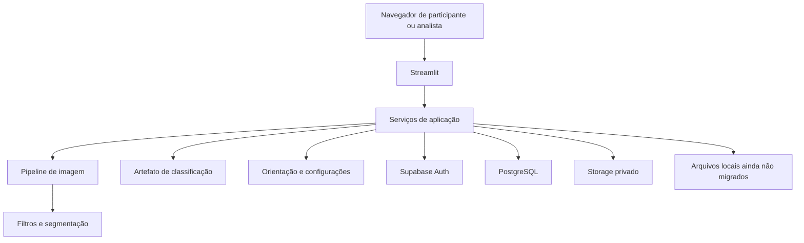

# Arquitetura atual

[Voltar ao projeto](../README.md) · Revisão de código: 23/09/2026

## Visão geral

O EcoScan é uma aplicação Python organizada em módulos, com interface Streamlit.
Não é uma arquitetura de microsserviços. O servidor Live é um módulo separado;
a interface principal ainda concentra uma quantidade significativa de composição
e apresentação em `src/ecoscan/ui/streamlit_app.py`.

## Responsabilidades

| Camada | Módulo | Responsabilidade |
| --- | --- | --- |
| Interface | `ui/` | Formulários, sessão, apresentação de resultados e operação |
| Orquestração | `services/analysis_service.py` | Pipeline, seleção de modelo, verificações e orientação |
| Processamento | `app/pipeline.py`, `image_processing/`, `segmentation/` | Preparação, diagnóstico, filtros, máscara e regiões |
| Reconhecimento | `classification/`, `training/` | Atributos, inferência e treinamento opcional |
| Descarte | `disposal/`, `config/` | Conteúdo, pontos, regras e escopo configurável |
| Identidade | `services/password_identity.py`, `services/identity.py` | Supabase Auth e alternativa OIDC |
| Persistência | `services/contribution_store.py`, `services/operational_store.py` | Protocolos, fotos, pontos e testes |
| Aprendizado | `services/learning_contributions.py`, `services/secretariat_training.py` | Revisão e preparação controlada de candidatos |

## Identidade e fronteira de confiança

O navegador não recebe a chave privilegiada do banco. O backend usa essa chave
para operações autorizadas e deve verificar identidade, papel e propriedade de
cada solicitação. RLS bloqueia acesso direto; não substitui a autorização no
backend que usa a chave privilegiada.

No login Supabase, o token é validado no provedor e o e-mail precisa estar
confirmado. O papel administrativo vem de uma lista explícita, nunca da URL ou
de metadados editáveis pelo usuário. A lista de cadastros reais revalida o papel
e apresenta e-mails mascarados. Tokens ficam na sessão; refresh e recuperação
completa de senha permanecem pendentes.

## Dados e falhas

Correções usam banco e bucket privado quando configurados. A foto autorizada é
reencodificada e tem metadados removidos; seu conteúdo visual ainda pode conter
dados pessoais. Pontos e testes possuem ativação independente após a migration 002.
Campanhas, denúncias e candidatos ainda dependem de arquivos locais.

O modo local é útil para desenvolvimento, mas não é substituto durável da nuvem.
Se a conexão remota configurada falha, o app deve informar a falha em vez de
produzir um histórico vazio ou gravar silenciosamente em outra base.

Upload da foto e inserção do protocolo são operações em serviços distintos;
uma falha parcial pode deixar objeto órfão. Revisões usam controle de versão,
e o banco possui restrições contra duplicatas. Ainda é necessário operacionalizar
retenção, backup, recuperação e auditoria de órfãos.

## Modelo e rastreabilidade

A seleção padrão procura Keras, KNN visual, SVM visual e baseline, nessa ordem,
conforme disponibilidade dos arquivos. Os modelos versionados no repositório
não incluem o dataset completo. Artefatos antigos podem conter classes legadas;
a aplicação restringe os resultados ao escopo ativo.

As decisões adaptativas, métodos e regiões podem ser inspecionados. A análise
registra o hash do modelo, mas isso não constitui uma plataforma completa de
experimentos. A validação deve comparar versões sobre dados independentes e
manter o resultado por classe, estado e dispositivo.

## Prioridades estruturais

1. Aceite ponta a ponta da identidade, revisão e isolamento de contas.
2. Migração dos fluxos locais que precisam de compartilhamento entre instâncias.
3. Recuperação de conta, limites contra abuso e política de retenção.
4. Contrato de avaliação/publicação de modelo com rollback e métricas independentes.
5. Redução incremental do módulo de interface com testes preservando os fluxos.

Estas são prioridades de evolução, não entregas declaradas como concluídas.
